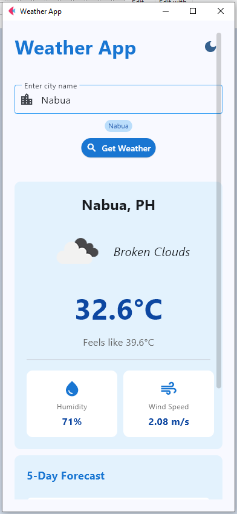
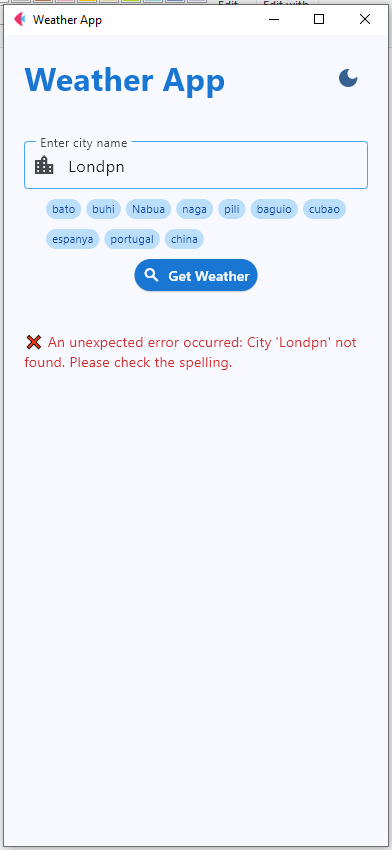
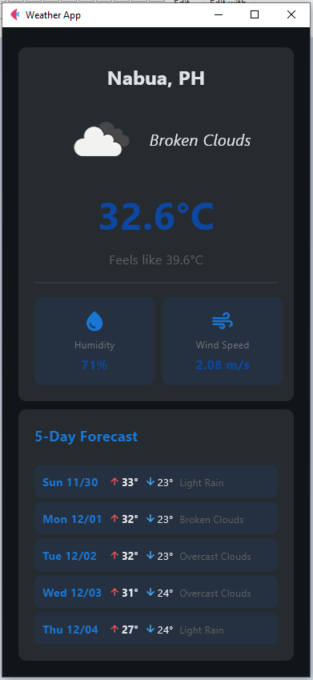
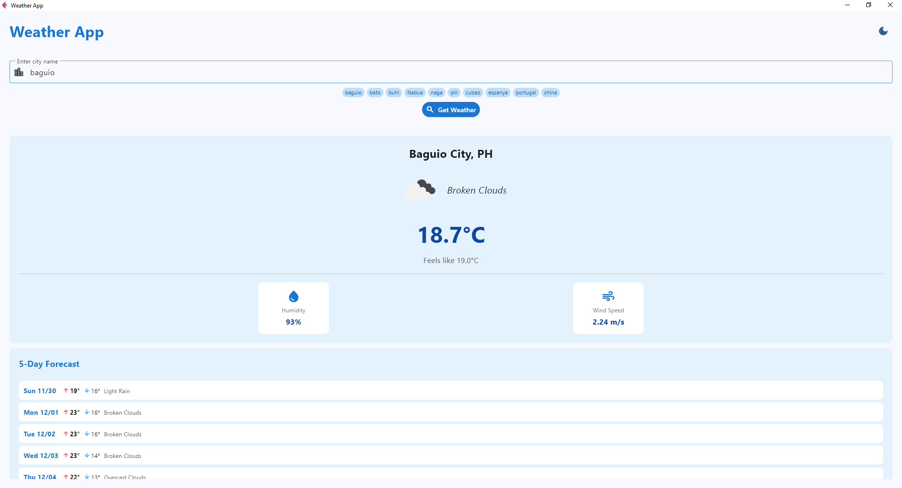

# Weather Application - Module 6 Lab

## Student Information
- **Name**: Jessica Mae T. Lanuzo
- **Student ID**: 231001081
- **Course**: CCCS 106
- **Section**: A

## Project Overview
This Weather Application provides real‑time weather information and a 5‑day forecast for any city entered by the user. It integrates the OpenWeatherMap API to fetch data and displays this in a modern, responsive UI built with Flet. The app also includes search history, error handling, and theme toggling for light/dark mode.

## Features Implemented

### Base Features
- [x] City search functionality
- [x] Current weather display
- [x] Temperature, humidity, wind speed
- [x] Weather icons
- [x] Error handling
- [x] Modern UI with Material Design

### Enhanced Features
1. **Search History**
   - **Description**: Stores the last 10 searched cities in a JSON file and displays them as clickable chips for quick re‑search.
   - **Why**: Improves usability by letting users revisit recent searches without retyping.
   - **Challenges**: Managing duplicates and ensuring the most recent search appears first. Solved by removing existing entries before reinserting them at the front of the list.

2. **5‑Day Forecast Display**
   - **Description**: Condenses raw 3‑hour interval forecast data into daily summaries (high/low temperatures and conditions) and displays them in a compact, readable format.
   - **Why**: Provides users with a clear overview of upcoming weather trends without overwhelming detail.
   - **Challenges**: Parsing and grouping forecast data correctly. Solved by summarizing entries by date and extracting min/max values and representative conditions.

2. **Theme Toggle (Light/Dark Mode)**
   - **Description**: Allows users to switch between light and dark themes, adapting container and text colors for readability.
   - **Why**: Enhances accessibility and user comfort in different environments.
   - **Challenges**: Ensuring background and text colors remain readable in both modes. Solved by using theme‑adaptive colors (ON_SECONDARY, with_opacity, etc.).


## Screenshots
<div style="text-align: center;">

  

Successful and unsuccessful city search with functional search history chips.
<br /><br />

  

Full weather and 5-day forecast report in light and dark mode/theme.

<br /><br />



Weather Application in fullscreen.
</div>

## Installation

### Prerequisites
- Python 3.8 or higher
- pip package manager

### Setup Instructions
```bash
# Clone the repository
git clone https://github.com/jazz-lnz/cccs106-projects.git
cd cccs106-projects/mod6_labs

# Create virtual environment
python -m venv venv
source venv/bin/activate  # On Windows: venv\Scripts\activate

# Install dependencies
pip install -r requirements.txt

# Create .env file
cp .env.example .env
# Add your OpenWeatherMap API key to .env
