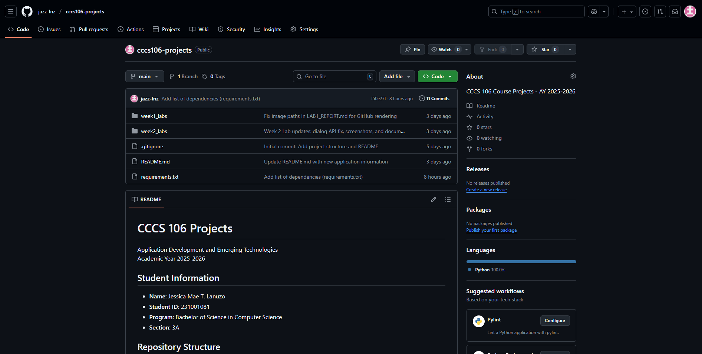
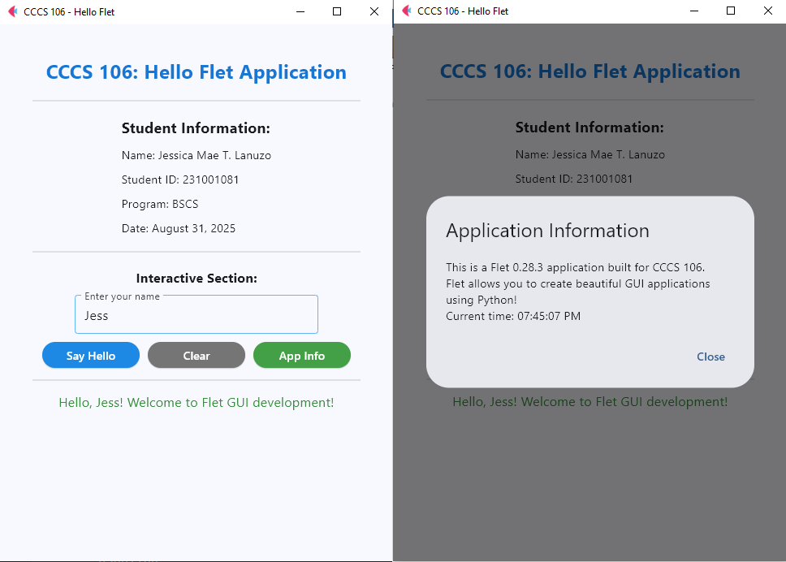
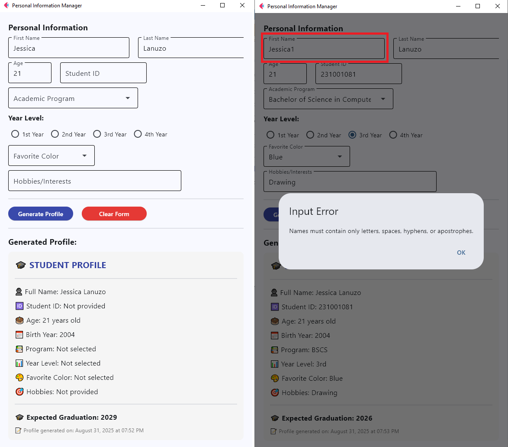

# Lab 2 Report: Git Version Control and Flet GUI Development

**Student Name:** Jessica Mae T. Lanuzo
**Student ID:** 231001081
**Section:** A
**Date:** August 31, 2025

## Git Configuration

### Repository Setup
- **GitHub Repository:** https://github.com/jazz-lnz/cccs106-projects.git
- **Local Repository:** ✅ Initialized and connected
- **Commit History:** 10 commits with descriptive messages (after final commit fow week 2; by the time this report is committed)

### Git Skills Demonstrated
- ✅ Repository initialization and configuration
- ✅ Adding, committing, and pushing changes
- ✅ Branch creation and merging
- ✅ Remote repository management

## Flet GUI Applications

### 1. hello_flet.py
- **Status:** ✅ Completed
- **Features:** Interactive greeting, student info display, app info display through dialog box
- **UI Components:** Text, TextField, Buttons, Dialog, Containers
- **Notes:** Program does not run on VSCode due to flet library issues, but works fine when run using system terminal.

### 2. personal_info_gui.py
- **Status:** ✅ Completed
- **Features:** Form inputs, dropdowns, radio buttons, profile generation
- **UI Components:** TextField, Dropdown, RadioGroup, Containers, Scrolling, di
- **Error Handling:** Input validation and user feedback
- **Notes:** Same with hello_flet.py. Does not run on VSCode, but runs fine on system terminal. Birth year is also computed based only on the age input and current year; may be off by 1 year.

### 3. enhanced_calculator.py
- **Status:** 🔄 In progress 
- **Features:** Arithmetic operations, square roots and exponents, comparison, error handling
- **UI Components:** Text, TextField, Button
- **Error Handling:** Input validation and user feedback
- **Notes:** Prototype for enhanced calculator GUI

## Technical Skills Developed

### Git Version Control
- Understanding of repository concepts
- Basic Git workflow (add, commit, push)
- Branch management and merging
- Remote repository collaboration

### Flet GUI Development
- Flet 0.28.3 syntax and components
- Page configuration and layout management
- Event handling and user interaction
- Modern UI design principles

## Challenges and Solutions

1. **Mistakenly committed ZIP file during Week 1 push**
    - *Challenge:* Accidentally included `week1_labs_lanuzo.zip` in the repository during initial commit.
    - *Solution:* Removed the ZIP file in a cleanup commit. Later verified its removal and committed again to ensure full exclusion from local and remote branches.

1. **Cleanup Commit Conflict**
    - *Challenge:* Because of unawareness of proper Git practices, deleted a ZIP file (`week1_labs_lanuzo.zip`) locally without removing it from Git’s tracking. This led to confusion when the file remained in the repository history and appeared on GitHub after pushing.
    - *Solution:* Used `git rm` to properly untrack the file and did a cleanup commit. Verified its removal and committed again.

1. **Git Branching Conflict due to Divergence of Remote and Local Main**
    - *Challenge:* Encountered a push rejection when trying to merge feature branch to `main`. Git flagged that the local `main` branch had diverged from the remote `main`, preventing a clean merge of the feature branch.
    - *Solution:* Used `git reset --hard origin/main` to align the local branch with the remote state. This resolved the sync issue and allowed a clean merge of `feature/enhanced-calculator` into `main` and a successful push into GitHub.

1. **App Dialog Boxes not Appearing**
    - *Challenge:* Initial versions of the applications (`hello_flet.py`, `personal_info_gui.py`) had dialog box-displaying features that did not work. 
    - *Solution:* Replaced outdated AlertDialog API (`page.dialog = dialog` and `dialog.open = True`) with recommended implementation on the Flet documentation (`page.open(dialog)`).

 

## Learning Outcomes

For this Lab Exercise, I was able to gain hands-on experience on how to manage local and remote code changes using Git and GitHub and was introduced to the concept of version control. I learned how to:
- track and commit changes using Git,
- resolve branching and push conflicts and perform a successful cleanup commit
- use git `reset --hard origin/main` to resolve sync issues
- integrate branches and delete them after integration

Regarding GUI development, I was able to apply the source codes for the sample program `hello_flet.py` into making a GUI for the calculator program made during week 1. Further improvements to the program can be made, but making the `enhanced_calculator.py` enabled me to experience integrating a CLI code into a simple GUI. Moreover, I was encouraged to browse the Flet documentation and learned of the updated AlertDialog API. I was able to apply this into the source codes for `hello_flet.py` and `personal_info_gui.py`, successfully making all the features work.

For collaborative programming, I practiced pushing structured and labeled commits to GitHub, documenting my workflow in Markdown, and verifying image rendering for lab reports. I also learned how small mistakes—like committing a ZIP file or mismanaging branches—can be corrected with proper Git checking and verification.

## Screenshots

### Git Repository
- ✅ GitHub repository with commit history

- ✅ Local git log showing commits

### GUI Applications
- ✅ hello_flet.py running with all features

- ✅ personal_info_gui.py with filled form and generated profile

- 🔄 enhanced_calculator.py with calculation results

## Future Enhancements

Application GUIs can still be improved, especially in the calculator app wherein AlertDialogs can be used to show error messages and better text display can be implemented for the results.