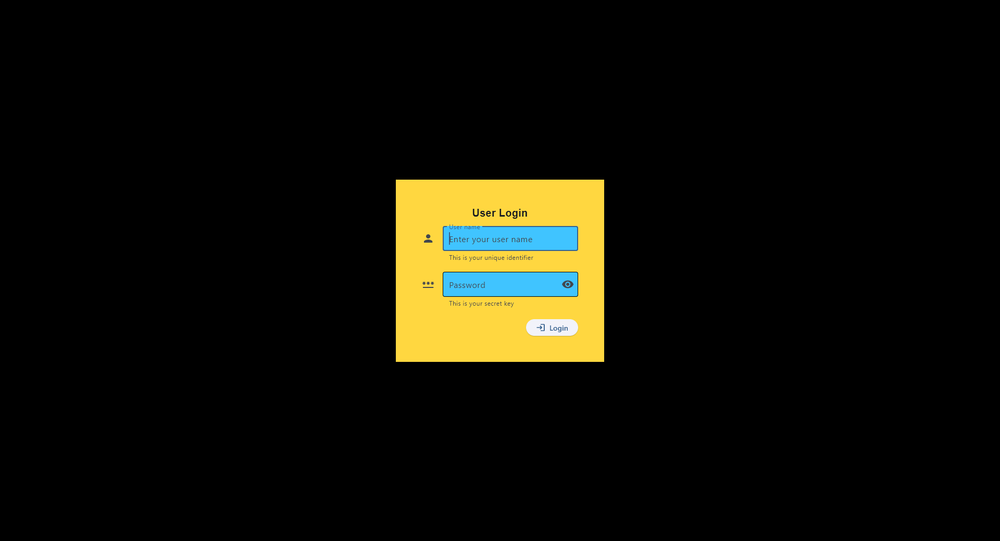
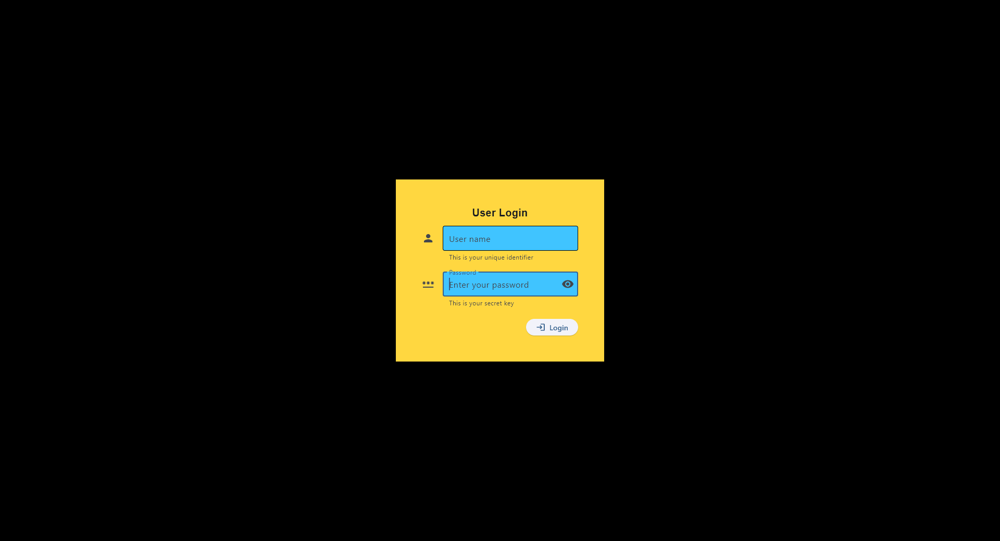

# Lab 3 Report: Flet User Login Application

**Student Name:** Jessica Mae T. Lanuzo
**Student ID:** 231001081
**Section:** A
**Date:** October 1, 2025

## Flet GUI Application: User Login App
- **Status**: ✅ Completed

- **Core Functions**:
    - Authenticate users against a MySQL database
    - Validate input fields before login attempt
    - Display feedback dialogs for success, failure, or input errors

- **UI Features**
    - Frameless and centered login window following specified styling
    - Input fields for username and password with icons and helper text
    - Password field supporting hiding and revealing input
    - Alert dialogs for login success, failure, input errors, and database issues

## Technical Skills Developed
### Flet GUI Development
* Custom window configuration (frameless, centered, fixed size)
* Event handling with on_click and async functions
* Input validation and user feedback using dialogs
* UI layout using Container, Column, and TextField components

### MySQL Integration
* Database creation and table setup using SQL
* Secure login logic using parameterized queries
* Error handling with try-except blocks
* Modular connection setup via db_connection.py

## Challenges and Solutions
1. **Centering Page Content Horizontally and Vertically**
    - *Challenge*: The lab required that all content within the page—not just the login form—be centered both vertically and horizontally.
    - *Solution*: 
      * Applied `page.vertical_alignment = ft.MainAxisAlignment.CENTER` and `page.horizontal_alignment = ft.CrossAxisAlignment.CENTER` to center all content within the page. 
      * Used `page.padding = ft.padding.symmetric(vertical=50)` to compress the layout vertically and maintain visual balance. 
      * For finer alignment, added `padding=ft.padding.only(right=10)` to the login button container for it to line up with the input field edges.

1. **Implementing Input Validation and Database Authentication**
    - *Challenge*: Ensuring that login attempts only proceed with valid input and that database errors are handled gracefully.
    - *Solution*: 
      * Used `if username_input.value.strip() == "" or password_input.value.strip() == ""` to check for empty fields and trigger an invalid_input_dialog. 
      * Wrapped the database query in a `try-except block` to catch connection issues and display a database_error_dialog. 
      * Used `conditional logic` to show either a success or failure dialog based on the query result.

## Learning Outcomes
This lab helped me:

* Build a functional login interface using Flet
* Connect a GUI to a MySQL backend securely
* Handle user input and provide vatious result feedback through AlertDialogs
* Apply updated Flet dialog handling for better UX
* Understand asynchronous function flow in Python

I also practiced structuring my code neatly. This lab reinforced in me the importance of input validation, error handling, and clean UI design.

## Screenshots
* ✅ Login window with styled input fields

  * Blank input fields

  * Filled input fields

* ✅ Successful login dialog

* ❌ Failed login dialog

* ⚠️ Input error dialog

* 🛑 Database error dialog

## Future Enhancements
* Add user registration and password hashing
* Improve UI responsiveness and animations
* Store login history or audit logs
