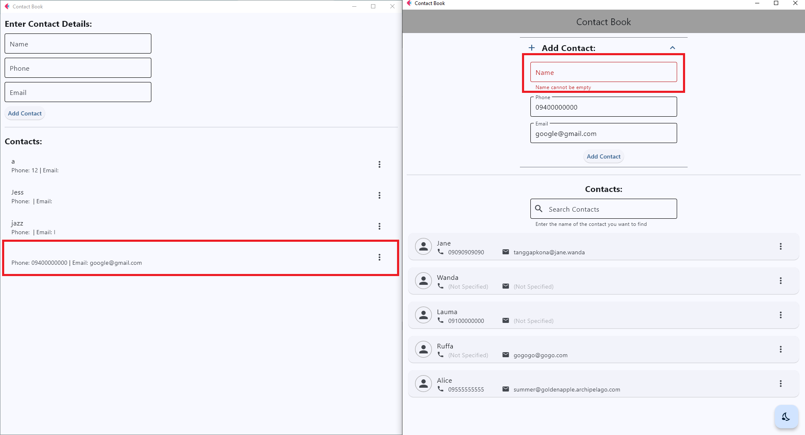
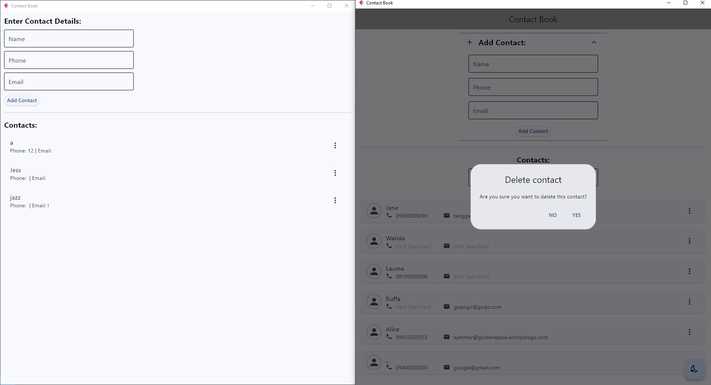
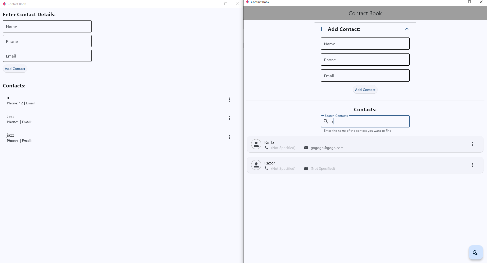
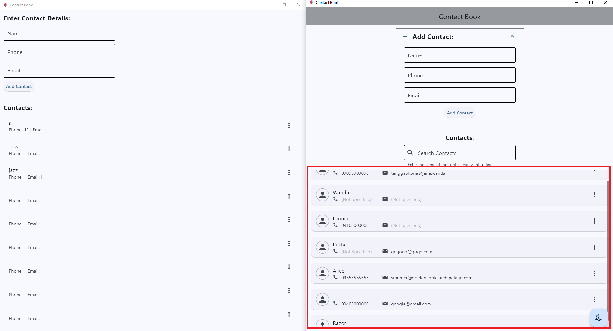
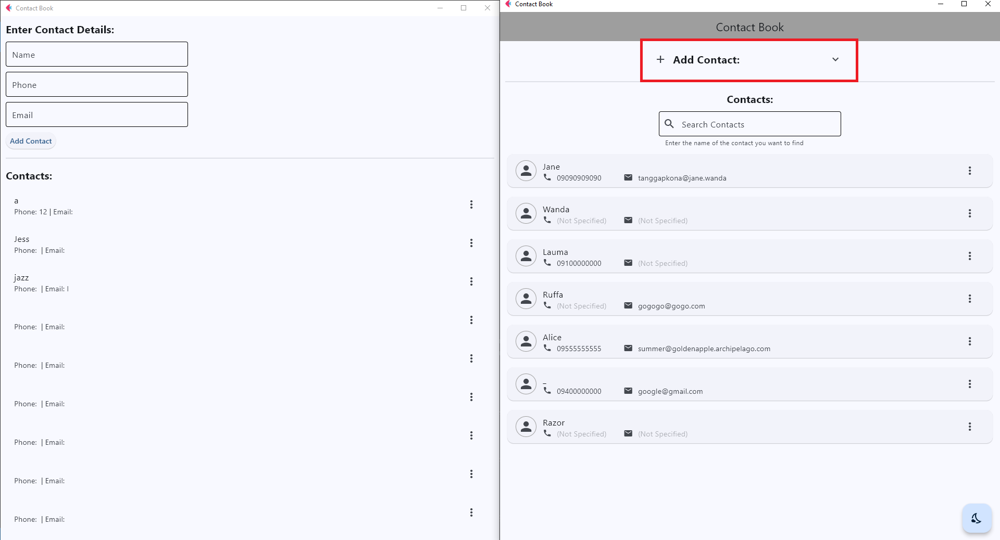
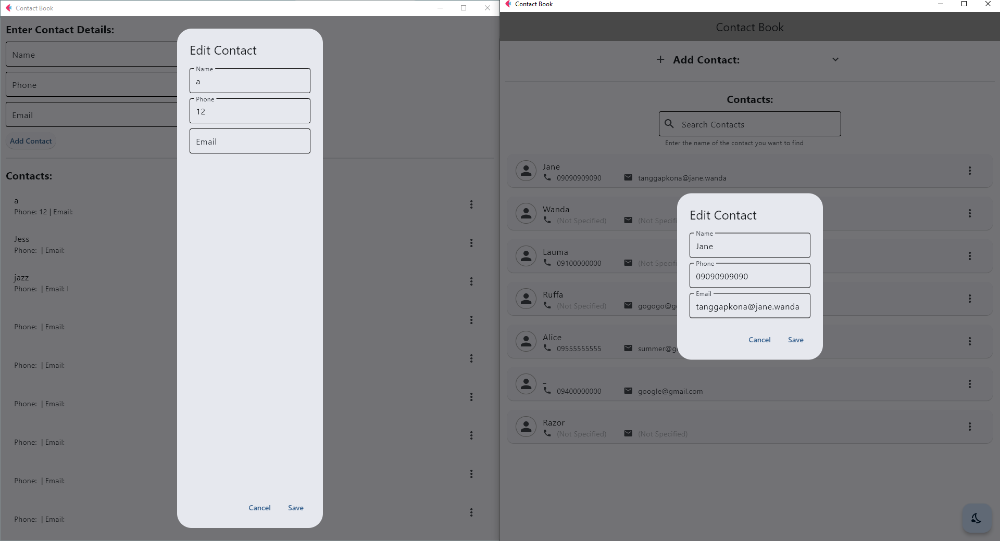
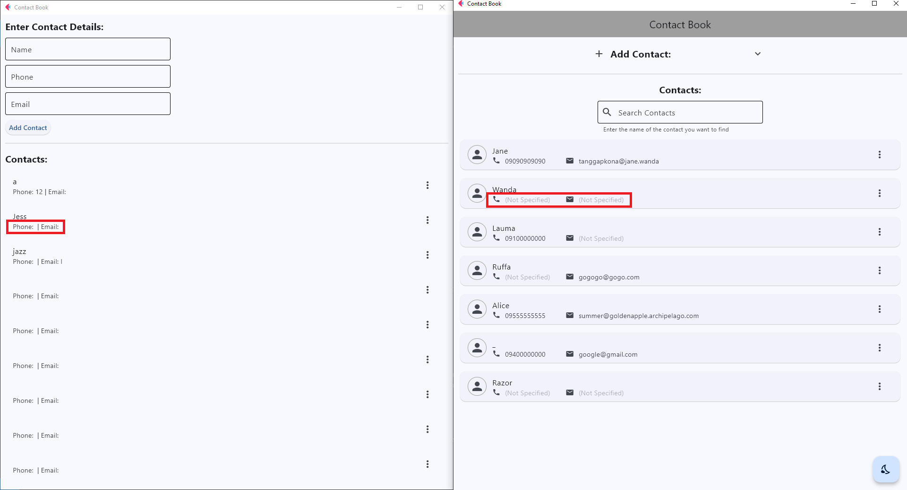
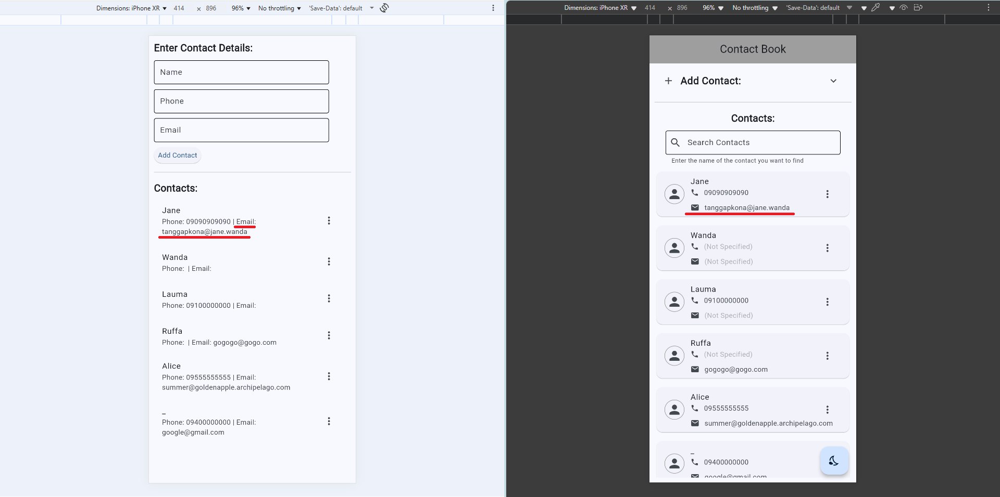

# Lab 4 Report: Contact Book Application Enhancement

**Student Name:** Jessica Mae T. Lanuzo
**Student ID:** 231001081
**Section:** A
**Date:** September 30, 2025

## Flet GUI Application: Contact Book App
- **Status**: ✅ Completed with Enhancements

- **Core Functions**:
    - Add, edit, and delete contacts
    - View and search contacts by name in real time
    - Toggle between light and dark mode

- **UI Features**
    - Collapsible 'Add Contact' section for cleaner layout
    - Input validation for required field (name cannot be empty)
    - Card-based UI with icons for phone and email
    - Confirmation dialog before deleting a contact
    - Scrollable contact list using ListView
    - Floating Action Button (FAB) for theme toggling

## Technical Skills Developed
### Flet GUI Development

- Dynamic layout management using `Column`, `Row`, `Card`, `ListView`, and `ExpansionTile`
- Event handling with `on_click` and `on_change` callbacks
- Real-time filtering using SQL `LIKE` clause
- Theme switching with `page.theme_mode` and icon updates
- Responsive design and scroll behavior

### SQLite Integration
- `Parameterized queries` for secure data handling
- Modular database functions for `CRUD` operations
- `Search term filtering` via get_all_contacts_db(search_term)

## App Enhancements & Screenshots
> *Basic Contact Book app (Left), Enhanced Contact Book app (right)*
### Input Validation

Prevent users from adding a contact with an empty name.

### Confirmation on Delete

Before deleting a contact, show a confirmation dialog.

### Search/Filter Functionality

Add a TextField at the top of the contacts list for searching.

### Theming (Dark Mode)

Add a switch or button to toggle between light and dark mode.

### Refine the UI

Enable scrolling through contact list.

Enable 'Add Contact' section collapse for wider view of contact list.

Enhance Edit dialog box appearance.

Add alternative text when no contact detail is provided and keep the contact details layout uniform.

Optimize UI contact list display for mobile devices.

## Challenges and Solutions
1. **Search Filtering Not Working Initially**
    - *Challenge*: SQL query failed due to incorrect tuple formatting.
    - *Solution*: Fixed by adding a comma to ensure single-element tuple: `(f"%{search_term}%",)`

1. **Theme Toggle Not Updating UI**
    - *Challenge*: `page.update` was referenced but not called.
    - *Solution*: Corrected to `page.update()` to trigger UI refresh.

1. **Floating Action Button Icon Not Switching**
    - *Challenge*: Icon didn’t update after theme toggle.
    - *Solution*: Used `nonlocal` to access and modify outer-scoped variables inside the toggle function.

1. **Overflow and Layout Clutter**
    - *Challenge*: Contact list felt cramped with input fields always visible.
    - *Solution*: Implemented collapsible input section using `ExpansionTile` for cleaner layout.

## Learning Outcomes
This enhancement activity deepened my understanding of:
- Modular UI design and layout responsiveness in Flet
- Real-time user interaction using `event handlers`
- Secure and dynamic SQL queries for filtering data
- Theme customization and state management using `nonlocal`
- Structuring Python projects for clarity and scalability

I also practiced debugging UI behavior, refining user experience, and documenting enhancements in Markdown. The activity reinforced the value of iterative design and clean code separation between logic, layout, and data.

## Future Enhancements
- Add profile pictures or avatars
- Maintain theme preference across sessions
- Export/import contacts to CSV

